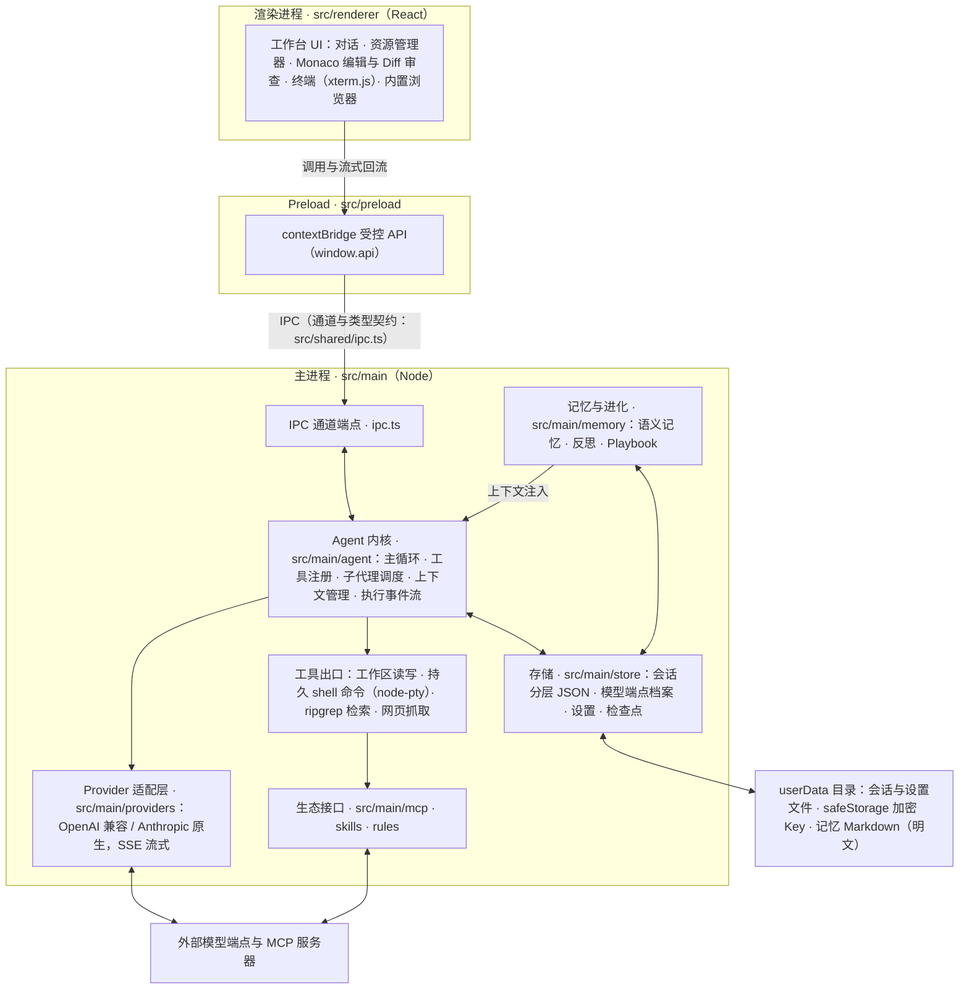

# 九十里路 · Jiushililu

> 行百里者半九十。一个**会自己长经验**的全能 AI 工作台 —— 越用越好用，越用越懂你。

「九十里路」是一个 Electron 桌面端的全能型 AI Agent 工作台。它不与框架、记忆层、MCP 生态竞争，
而是把力气花在 **Agent 内核与自进化闭环**上：干活（Generator）→ 复盘（Reflector）→ 沉淀（Curator）→ 经验手册自动回注上下文（ACE）。

- **模型全自定义接入**：不内置任何模型与 API Key，OpenAI 兼容协议 + Anthropic 原生协议双适配；
  端点档案化管理（每端点独立 Key，经 safeStorage 加密），支持免保存拉取模型列表与思考强度配置
- **安全底盘**：命令白名单、Key 加密存储（safeStorage）、操作审计、人工卡点
- **学习载体**：本项目同时是一份公开的 Agent 技术学习笔记。开发规范为**项目本地文件**
  （`AGENTS.md`，因含个人机器约定故不入库），跨工具事实标准同名，本仓库未随包分发

## 安装

- **Windows x64**：GitHub Releases 提供 `Jiushililu-Setup-<version>.exe`（NSIS 安装版）与
  `Jiushililu-Portable-<version>.exe`（便携版）双产物，当前仅发布 Windows x64 包。
- 首次运行后在设置页配置模型端点即可使用，无任何预置模型与凭据。
- 源码运行：仓库根目录执行 `npm install` 后 `npm run dev`。

## 当前状态

**v0.13.90**（分期：P0 骨架 → P1 内核 → P2 工作台 → P3 生态 → P4 进化 → P5 成熟）。

- **已完成**：P0 骨架（三进程 + 双协议 Provider + 流式对话 + Key 加密存储）· P1 内核（主循环 +
  工具层 + 三档权限门控 + 检查点回滚 + JSON 分层会话存储 + 计划批准 + 精确替换 edit 工具）·
  P2 工作台（工作台分栏（比例制布局）/ Monaco 编辑与 Diff 审查 / 内置终端（真 PTY，node-pty
  N-API，持久 shell 会话，PowerShell profile 可选加载）/ 资源管理器 / 内置浏览器 /
  多会话并发（上限 3）/ 用量计量与省 token 档位 / 系统集成开关 / 子 Agent 管理 / 模型分组切换 /
  任务栏自动折叠 / 消息分段化（思考块、工具卡与正文按真实顺序交错、随会话落盘、重启不丢））
- **0.13.59 → 0.13.83 增量（用户可见）**：消息操作条（复制正文 / 重新生成 / 编辑提问）与消息时间戳 ·
  会话刻度条（滚动联动高亮 + 预览卡 + 滚轮跳轮；预览卡自 0.13.86 起改为**按住刻度条拖动才出、松手即收回**，此前是悬停即出 + 滚动常显）· 语音输入（点按录音，OpenAI 兼容转写端点自配，
  首次录音前隐私披露）· 开发环境探测（六类来源发现 Node / Python / uv，版本实测）·
  电脑操作接入（依赖外部 windows-mcp 服务，「添加 MCP」与「电脑控制」开关两道闸独立，
  工具白名单门控）· 技能管理（设置页新建 / 导入 / 删除 / 开关，9 个内置方法论技能随包分发，
  输入框「/」调用）· MCP 每服务器开关（关闭即断进程且不再下发工具）· 子 Agent 按工具声明与
  权限档交集装配、做事纪律按实收工具注入 · 卡顿归因探针（IPC 面包屑 + 同步块探针 + 存活心跳）·
  时间线从右栏页签移入主对话头部
- **P3 生态（整期收口）**：技能系统（两层加载 + 覆盖 + fail-soft + 条件注册）·
  MCP 客户端（stdio / SSE + 工具聚合 + 执行确认桥）·
  分层规则系统（AGENTS.md / Rules / Harness 三层职责分离）
- **P4 进化四环全闭**：
  ① 语义记忆（两条写入通路：模型 `remember` / 用户选中即记；影响面三分类；注入与预算截断；
  事件流；三条架构守卫；记忆页签与写入痕迹面板；支持从其他 AI 工具两步导入记忆）
  ② 自动捕获（会话切换异步反思 → 候选**物理隔离**在 `candidates/`（与 `notes/` 平级，不靠过滤）
  → 批准/拒绝/冲突标记；前置门 2KB；日上限与队列）
  ③ Playbook（`evolution/playbooks/` 布局，tags 条件召回，预算与语义记忆分开；
  `save_playbook` / `recall_playbook` 已注册下发；设置页 Playbook 分区）
  ④ 遗忘与度量（LRU 遗忘**移入归档区、可一键恢复**（不硬删）+ style 豁免；描述相似度警告 + 记忆去重闸门；纠正通路 +
  重复纠正率 / 误伤率）· 另含**用户画像**与 **eval 集**（L1 场景回归 16 条 + L2 在线评测）
- **P5 成熟（主体）**：执行事件流与时间线（可观测回放，事件仅含元数据）· 智能标题 · 滚动摘要 ·
  渲染性能治理（页签保活 + Markdown 解析缓存，读数见下方 Benchmark）· 网页抓取受控重定向 ·
  记忆读取与注入缓存 · 消息分段化
- **未开始**：插件栏与外围能力（表情包 / 移动助手）· 端到端测试的完整矩阵（冒烟骨架
  已交付并接入 CI，覆盖待扩充）· IDE 能力（LSP / DAP）与 Office 文档编辑能力（均已立项，待批准）
- 逐条状态见 **`PLAN/待办总览.md`**（全项目未完成追踪的**唯一源**）+ `PLAN/plan1`（分期）·
  `plan7`（工作台）· `plan8`（技术债）· `plan19`（记忆批）

> ⚠️ **关于记忆的安全声明（如实，不是免责套话）**
> 记忆层做了三道防线：**架构守卫**（记忆层代码物理上碰不到权限设置）、**写入侧判定**
> （授权语义拒写 + 凭据形状硬拒）、**可见性**（写入痕迹面板 + 巡检区）。
> 但它们是**必要非充分条件，不是"已解决"**：判定是关键词与形状匹配，可被同义改写绕过；
> 只读权限档也具备**出境与操作远端页面**的能力；记忆文件是 userData 下的**明文 markdown**，
> 本机任意进程可读。请把巡检区当习惯用，别把护栏当承诺信。
> ⚠️ 自动捕获（反思）会**读会话正文**并可能产出候选记忆；候选在用户批准前**不进注入索引段**，
> 且**物理隔离**在独立目录。但反思本身是一次**出境的模型调用**，请据此决定是否开启。

## 架构

进程与数据流（渲染进程 / preload 受控桥 / 主进程）：



要点：渲染进程不接触 Node 与 Electron API，一切经 preload 白名单桥；IPC 通道名字面量只在
`src/shared/ipc.ts` 定义一次，主/渲染两侧共用类型契约；模型流式响应由 `chat-emitter` 单一发送口
回流界面。

## Benchmark

复现命令（均在 `package.json` scripts，从仓库根执行；Windows x64 为本项目实测基线平台）：

| 命令 | 测什么 | 是否调用模型 |
|---|---|:--:|
| `npm test` | 单元测试（Vitest，含真起子进程的用例） | 否 |
| `npm run bench` | vitest 基准：会话存储三档量级、单会话巨型文件重写、记忆 100 条满载（阈值断言） | 否 |
| `npm run bench:all` | 聚合基准：跑 bench + 环境对照（裸同步读 ms/文件），JSON 与 Markdown 报告落 `bench/`（不入库），与上一轮读数对比 | 否 |
| `npm run test:e2e` | Playwright 端到端冒烟（驱动真 Electron 入口，Linux CI 走 xvfb） | 否 |
| `npm run evals` | L2 在线评测（pass@k，`--repeat=N` 多次采样，报告落 `bench/`） | **是，消耗真实额度** |
| `npm run bench:window` | 工具输出窗口化 A/B 校准（需先 `npm run build`；一次启动只跑一臂） | **是，消耗真实额度** |

归档读数（判读阈值类结果时务必带上 `bench:all` 报告首行的环境对照）：

| 读数 | 命令 | 实测条件 |
|---|---|---|
| 单元测试 1942 通过 / 1 跳过 | `npm test` | 2026-09-21，Windows x64，全量约 15s |
| 记忆 100 条满载读取阈值内（list 中位数 ≤ 45ms） | `npm run bench:all` | 2026-09-17，Windows x64，Defender 实时防护开启（裸同步读底噪 ~0.47ms/文件） |
| 记忆加载缓存优化后满载基准耗时约 -63% | `npm run bench:all` | v0.13.63 收口三跑实测（2026-09-18，同上环境） |
| 会话切换 765ms → 281ms（卡顿帧 87 → 2） | 无一键复现脚本 | v0.13.50 收口真机渲染实测（2026-09-16，Windows），单次对照 |
| L2 评测 pass@k 3/3 | `npm run evals -- --repeat=3` | 2026-09-16，deepseek flash 端点；结果随所选模型与端点变化，不构成横向指标 |

**方差声明**：本地实测显示模型类 A/B 单轮抖动可达数倍（n=1 对照组曾测得 3.3 倍方差），因此本仓库
的结论一律要求多次采样取中位数；README 中不出现「提升 N%」式的单轮效果声明，省 token 档位的
校准仍在进行中（默认参数为保守起点）。

CI（GitHub Actions，ubuntu-latest）在 master push 与 pull request 上跑 lint / typecheck / build /
单元测试与 e2e 冒烟（e2e 在 xvfb 下驱动真 Electron 入口）。

## 开发

```bash
npm install        # Electron 二进制自动走 .npmrc 里的国内镜像
npm run dev        # 开发模式（热更新）
npm run build      # 构建（产物在 out/）
npm start          # 运行构建产物（冷启动）
npm run dist       # 打包 Windows 安装包 + 便携版（产物在 dist/）
npm test           # 单元测试
npm run typecheck  # 类型检查
npm run lint       # ESLint
```

> 换应用图标：替换 `resources/icon-source.jpg` 后运行 `scripts/make_icons.py`（需 Pillow），重新 `npm run dist` 即可。

## 目录结构

```
src/
  main/         主进程
    agent/        Agent 内核：主循环、工具注册、子代理调度、上下文、执行事件流
    providers/    模型适配层（OpenAI 兼容 / Anthropic 原生、SSE）
    store/        持久化：会话、设置、模型端点、检查点、数据目录
    memory/       语义记忆、反思、Playbook
    mcp/ skills/ rules/   MCP 客户端、技能加载、规则注入
    retrieval/   代码检索（ripgrep）
  preload/      预加载脚本：contextBridge 受控桥
  renderer/     渲染进程：React UI
  shared/       主/渲染共享类型与 IPC 通道契约
tests/
  unit/         单元测试（Vitest）
  e2e/          端到端冒烟（Playwright）
  bench/        vitest 基准
  evals/        L1 场景回归
bench/          基准与评测的历史报告（git 忽略，本机可复现）
config/         全部构建 / 类型 / 检查 / 打包配置
scripts/        门禁、打包校验、评测驱动等工具脚本
.github/        CI 工作流
```

架构与分期详情见本地 `PLAN/`（内部台账，不入库）；项目约定以 `AGENTS.md` 为**唯一真相源**（本地文件，不入库）。

## License

MIT
